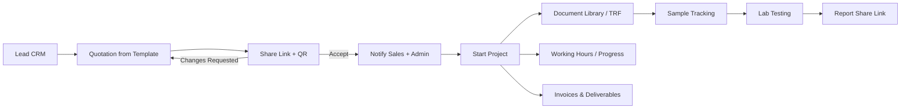

# InstaCertify ERP Architecture (ERPNext v16)

## Process flow

## Roles

| Role | Capabilities |
|------|----------------|
| **IC Admin** | Full oversight, Excel export everywhere, HR profile create/approve, settings |
| **IC All Ops Manager** | View everything, authorise/submit quotations, export |
| **IC Sales Person** | Create/edit quotes (incl. from templates), own/assigned leads & quotes, closed-project progress, assigned customer history |
| **IC Operations Manager** | Projects, working hours, customer records, sample/test ops |
| **IC HR** | Employee profiles, joining letters, attendance support |

## Revenue rule

- **Consulting** and **Lab / Testing** lines always count as InstaCertify revenue.
- **Government fees** and portal/lab-direct payables are tracked but not marked as own revenue unless explicitly checked.

## Customer portals

| Path | Purpose |
|------|---------|
| `/quote/<token>` | View / accept / request changes on quotation |
| `/docs-upload/<token>` | Upload checklist files (PDF/image) |
| `/trf/<token>` | View Test Request Form |
| `/report/<token>` | Download shared lab report |
| `/sample/<code>` | Public sample tracking (QR on package) |

## Modules

- **IC CRM** — Leads, consultants, lead sources
- **IC Quotation** — Templates, costing, QR, share/accept
- **IC Projects** — Progress, credentials, incidents, document library
- **IC Testing** — Labs library, prices, scope sheets, sample workflow
- **IC Assets** — Organisation asset register with auto codes
- **IC HR Portal** — Employee profile, joining letter QR, salary slip / holiday links
- **IC Setup** — Brand colours, defaults, services master, dashboard
